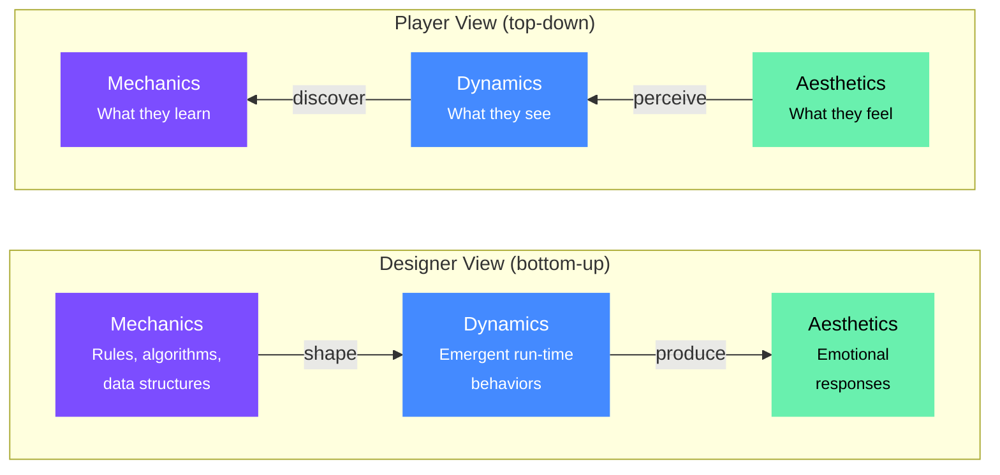

# E6 — Game Design Fundamentals

> **Category:** Explanation · **Related:** [C1 Genre Reference](C1_genre_reference.md) · [C2 Game Feel & Genre Craft](C2_game_feel_and_genre_craft.md) · [E4 Project Management](../project-management/E4_project_management.md) · [G10 Custom Game Systems](../../monogame-arch/guides/G10_custom_game_systems.md) · [G11 Programming Principles](../../monogame-arch/guides/G11_programming_principles.md)

---

Design frameworks, player motivation models, feedback systems, and design philosophy — the conceptual foundations that inform every mechanical decision in a 2D game.

---

## The Canonical Frameworks

Three books form the backbone of modern game design thinking.

**Jesse Schell's *The Art of Game Design*** organizes design around **100+ "lenses"** — questions that force you to examine your game from different perspectives. The most critical: **Lens #1 (Essential Experience)** asks "What experience do I want the player to have?" Every decision flows from that answer. His **Elemental Tetrad** decomposes games into Mechanics, Story, Aesthetics, and Technology — all four must reinforce each other. His **Interest Curve** principle states that good experiences start with a hook, alternate peaks and valleys with an upward trend, then climax near the end.

**Raph Koster's *A Theory of Fun*** argues that **fun is the brain's reward for learning patterns**. Games become boring when players have "grokked" all available patterns (tic-tac-toe) and stay engaging when the pattern space is deep enough to sustain discovery (chess). His practical recipe: a game needs preparation (not pure chance), a sense of space, a core mechanic, a range of challenges not quickly exhausted, multiple choices, and skill requirements.

**Tracy Fullerton's *Game Design Workshop*** provides the **playcentric methodology** used at USC's program. She decomposes games into **formal elements** (players, objectives, procedures, rules, resources, conflict, boundaries, outcome), **dramatic elements** (challenge, play, premise, story), and **dynamic elements** (feedback systems, economies, emergence). Her core mantra: playtest early, playtest often, with real target players.

---

## The MDA Framework

Created by Hunicke, LeBlanc, and Zubek, MDA replaces vague terms like "fun" with three analyzable layers:

- **Mechanics** — the rules, algorithms, and data structures the designer directly controls
- **Dynamics** — the emergent run-time behaviors that arise when mechanics interact with player input
- **Aesthetics** — the emotional responses the player actually experiences

The framework identifies **8 aesthetic categories**: Sensation (sense-pleasure), Fantasy (make-believe), Narrative (drama), Challenge (obstacle course), Fellowship (social bonding), Discovery (exploration), Expression (self-discovery and customization), and Submission (relaxation).

Designers work bottom-up — tuning mechanics to shape dynamics to produce target aesthetics — while players experience top-down, feeling aesthetics first. A small mechanical change (how health regenerates) cascades through dynamics into a completely different aesthetic: frequent regeneration creates fast-paced stamina play; rare checkpoint-only healing creates survival horror tension.

**Applied MDA example — Celeste**: Mechanics include dash, wall-climb, grab stamina, and screen-by-screen levels. Dynamics produce micro-mastery loops (die -> learn -> retry -> succeed) and speed optimization. Target aesthetics are Challenge (precision), Narrative (overcoming self-doubt mirrored in gameplay), and Sensation (tight controls with satisfying screen-shakes).

---

## Design Pillars

Pillars are **3-5 statements** that define a game's core identity, created early and used as a decision filter throughout development. Good pillars describe *feelings and emotions*, not features. "Players will achieve flow through challenging precision gameplay" guides decisions; "our game will feature 2D platforming" does not.

Real examples:
- **Celeste** — precision flow, supportive narrative, accessibility through difficulty modulation
- **Hades** — narrative integration with death (dying advances the story), build variety (boons and weapons create unique runs), responsive feedback (every action has crisp audio-visual response)
- **Dark Souls** — punishing-but-fair combat, environmental storytelling, oppressive atmosphere

Every proposed feature should be evaluated against pillars: does it serve at least one? If not, cut it.

---

## Player Motivation

### Bartle's Taxonomy (1996)

Maps MUD players into four types: Achievers (collect, complete, level up — ~10%), Explorers (discover secrets and systems), Socializers (interact with other players — ~80% in multiplayer), and Killers (seek dominance — <1%). The model is intuitive but was designed for MMOs and oversimplifies single-player motivation. Nick Yee's factor analysis of 7,000 players found "Explorer" didn't hold as a coherent category.

### Self-Determination Theory

A more empirically robust foundation with three innate psychological needs:

- **Autonomy** — feeling in control: meaningful choices, multiple paths
- **Competence** — feeling effective: clear feedback, balanced challenges, mastery moments
- **Relatedness** — feeling connected: cooperative play, meaningful NPCs

Games satisfying all three produce higher engagement and more sustainable motivation than extrinsic reward systems.

### Quantic Foundry's Model

Based on factor analysis of **500,000+ gamers**, identifies 12 motivations in 6 pairs: Destruction/Excitement, Competition/Community, Challenge/Strategy, Completion/Power, Fantasy/Story, and Design/Discovery. This is the most empirically validated motivation model available.

### Nicole Lazzaro's 4 Keys to Fun

- **Hard Fun** — mastery leads to triumph
- **Easy Fun** — curiosity leads to wonder
- **People Fun** — friendship leads to amusement
- **Serious Fun** — meaning leads to excitement

Best-selling games offer at least 3 of the 4.

---

## Feedback Loops and Risk/Reward

**Positive feedback loops** amplify change: success breeds more success (Monopoly's property snowball, kill-streak bonuses). They end games faster but can frustrate losing players.

**Negative feedback loops** dampen change and push toward equilibrium: Mario Kart gives weaker items to first-place players and Blue Shells to last-place. They prolong competition but feel "unfair" if too obvious.

The best designs blend both — Hades turns death (negative loop: lose progress) into progression (positive loop: advance story and unlock permanent upgrades).

**Risk/reward** is the engine of interesting decisions. Greater risks must be compensated by proportionally greater rewards. Design methods: randomness (dice), imperfect information (hidden knowledge), and skill-based risk (hard-to-execute actions like parries). Critical insight: the best games let players **modulate their own risk** through skill. Spelunky's golden idol triggers a boulder trap — massive gold reward but potentially fatal, and entirely optional.

---

## Pacing, Tension, and Flow

Csikszentmihalyi's **flow state** occurs when challenge matches skill, both at a sufficiently high level. Games manage this at two scales:

- **Macroflow** — the overall difficulty curve across hours of play, managed through new mechanics and rising difficulty
- **Microflow** — moment-to-moment absorption during tight gameplay sequences

Tension and release patterns follow the **interest curve**: peaks of intensity separated by valleys of rest. **Valleys are as important as peaks** — without rest, intensity becomes the norm and loses impact.

Practical pacing principles:
- Contrast creates impact (combat feels intense only after calm exploration)
- Escalation should trend upward with oscillations
- Later peaks should arrive faster and higher
- Alternate between combat, traversal, puzzle, and story

A useful formula: **~70% successful experiences + ~30% moderate challenges** produces the optimal emotional curve for most players. Hardcore audiences prefer more intense spikes; casual audiences prefer gentler progression.

---

## Iteration Is Everything

The most important methodology in game design: **ideate -> prototype -> playtest -> iterate**.

Eric Zimmerman: "Stop brainstorming and start prototyping. The truth is that it doesn't really matter — any place is a good starting point." The corollary: "Great designers do not design great games. They usually design really bad games, and then they iterate on them until the games become great."

Paper prototyping for digital games — creating board-game versions to test core mechanics before writing code — remains the fastest way to validate ideas. Keep prototypes ugly; index cards, not illustrated playing cards. The more experimental the idea, the more iteration it requires. "Fail fast" means testing high-risk assumptions early through lightweight prototypes, gaining the psychological freedom to discard bad ideas cheaply.

---

## The Designer Spectrum: Auteur to Player-Servant

**Jonathan Blow** represents the designer-centric pole: "I don't agree that games have to be the most fun they can be; I will get rid of fun if it means I can get at something deeper or more complete." He refused to add a hint system to The Witness because it opposed the game's fundamental philosophy of genuine understanding. Miyamoto similarly designs from instinct: "I never try to look for what people want and then try to make that game."

**Sid Meier** exemplifies the player-centric pole: "Gameplay is a psychological experience. It's all in our heads." He adjusted randomness in Civilization because true randomness frustrated players (the gambler's fallacy), demonstrating willingness to bend mathematical truth for player experience. He removed civilization decline mechanics because players simply reloaded saves.

The reconciling principle: **players are almost always right about identifying problems but almost always wrong about solutions.** Listen to players when they find problems; create the solutions yourself.

---

## Depth from Simplicity

Nolan Bushnell's "easy to learn, hard to master" captures the ideal: a low **skill floor** (anyone can start) with a high **skill ceiling** (years of mastery potential). The gap between them is the mastery space. **Depth** (meaningful, interesting emergent outcomes) must be maximized while **complexity** (rules and systems the player must understand) is minimized.

- **Chess**: 6 piece types, simple movement rules -> near-infinite strategic depth
- **Tetris**: 7 piece shapes -> exponentially complex strategies around T-spins and combos
- **Rocket League**: drive, jump, boost -> aerial dribbles and flip resets discovered years after release
- **Downwell**: only **3 colors** and a single tool (gunboots) that simultaneously slows descent, provides ranged attack, and destroys obstacles. Landing on enemies reloads ammo AND bounces the player, creating a compelling loop from one mechanic

---

## Emergence: Systems That Surprise Their Creators

Emergent gameplay occurs when multiple game systems interact to produce behaviors the designers never explicitly scripted. See [E7 Emergent Puzzle Design](./E7_emergent_puzzle_design.md) for a deep dive.

**Breath of the Wild's** chemistry engine classifies the world into materials and elements, governed by three rules: elements change material states, elements change other elements' states, and materials cannot change materials. This small rule set creates multiplicative gameplay — rolling boulders onto enemies, using magnesis to weaponize metal, exploiting lightning storms against enemies with metal weapons.

**Dwarf Fortress** demonstrates the extreme: cats getting drunk because dwarves spill alcohol, cats walk through puddles, then groom themselves. No designer scripted this — it emerged from honest simulations of physics, biology, and behavior.

The design principle: create **systems that interact**, not scripts that execute. Transparency is critical — players need to grasp underlying rules quickly enough to experiment confidently.

---

## Constraints as Creative Engines

"Ever try painting with only three colors? It's infuriating at first. Then, something magical happens."

NES limitations directly created iconic design: Mario's hat eliminated the need to animate hair, the mustache replaced a visible mouth, and overalls made arm movement visible. David Wise composed Donkey Kong Country's soundtrack on 4 channels and said the constraints "helped carve my style."

Gunpei Yokoi's **"lateral thinking with withered technology"** — using mature, cheap technology in innovative ways — drove Nintendo's greatest hardware successes. The Game Boy won with a monochrome screen because it had superior battery life. The Wii used GameCube-era internals but added motion controls.

For indie developers, constraints prevent scope creep and force focus on what matters.

---

## Three Designer Philosophies Worth Internalizing

### Sid Meier's "Interesting Decisions"

A decision is interesting when it:
- Presents genuine trade-offs (no dominant option)
- Has visible consequences
- Gives the player enough information to reason but not enough to be certain
- Creates tension between short-term and long-term benefit

If one option is always optimal, it's not a real choice.

### Jonathan Blow's "Listening to the System"

Before Braid, Blow believed the designer's role was to impose ideas through code. Then he discovered that asking a single question — "What happens if I give the player unlimited time-rewinding?" — and watching the system's answers produced puzzles he could never have designed top-down. The designer becomes a curator, presenting the system's emergent answers rather than dictating solutions. For The Witness, constraining lines so they can't cross themselves naturally created partition puzzles — "something that came from exploration, not from a top-down decision."

### Miyamoto's "Start with the Toy"

Games begin with a fun interaction, not a story. Mario's jump, Link's sword swing, Pikmin's creature management — each starts as a satisfying atomic interaction. "A good idea does not solve just one single problem, but rather can solve multiple problems at once." He designs the second level first, building level 1 only after everything else is complete, so the tutorial is informed by the full game experience.

---

## Indie Scope Management

The minimum viable game (MVP) is the most important scope tool for indie developers: **identify the core gameplay loop, build it to be fun, then layer complexity.** "A finished, imperfect game is infinitely more valuable than a perfect, unfinished one."

Feature creep prevention:
- Maintain a "Not Now" list for future updates
- Evaluate every addition against "Does this enhance the core experience or dilute it?"
- Prioritize ruthlessly between must-haves and nice-to-haves
- A solo developer cannot compete on content volume — focus on a unique twist or strong core mechanic rather than breadth
- Build a vertical slice (one complete level with all systems working) to prove the concept before scaling

See also [E4 Project Management](../project-management/E4_project_management.md) for implementation-level scope and planning tools.

---

## Playtesting: What Players Do vs. What They Say

Players say they want one thing but their behavior reveals another. Behavioral data (where players die, get lost, quit) is more reliable than verbal feedback.

Key principles:
- "We're testing the game, not you" (the Arkadium principle)
- Look for **patterns across multiple testers**, not individual opinions
- Give playtesters enough time to learn controls and experience actual gameplay — rushed tests yield only speculative or negative feedback
- Sessions of **45-60 minutes** are typical before fatigue corrupts results

---

## Through-Lines

Several principles recur across this document, forming a unified design philosophy:

- **Systems beat scripts.** The most engaging games create systems whose interactions produce experiences the designer never explicitly authored.
- **Constraints amplify creativity.** Embracing constraints — in scope, palette, mechanic count, and technology — produces more focused, more polished games.
- **Juice is communication.** Every screen shake, hitstop frame, and particle burst confirms that a hit connected, signals danger, or acknowledges player input. See [C2 Game Feel & Genre Craft](C2_game_feel_and_genre_craft.md).
- **Respect the player's intelligence, time, and agency.** Teach through design rather than text. Make death informative rather than punishing. Let players modulate their own risk.
