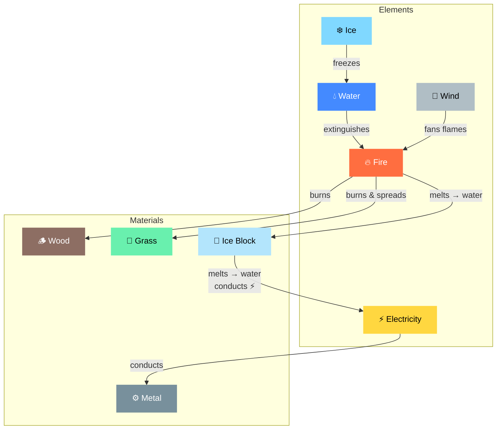

# E7 — Emergent Puzzle Design


> **Category:** Explanation · **Related:** [C1 Genre Reference](C1_genre_reference.md) · [C2 Game Feel & Genre Craft](C2_game_feel_and_genre_craft.md) · [G10 Custom Game Systems](../../monogame-arch/guides/G10_custom_game_systems.md) · [G3 Physics & Collision](../../monogame-arch/guides/G3_physics_and_collision.md)

---

Emergent vs contrived puzzles, chemistry engine architecture, rule-as-object design, combinatorial mechanics, and procedural generation techniques for building puzzle systems that surprise their creators.

---

## What Makes Puzzles Emergent Rather Than Contrived

**Contrived puzzles** have a single predetermined solution with rules that exist only for that specific challenge. They follow a "story, story, STOP: puzzle" pattern.

**Emergent puzzles** arise naturally from system interactions — multiple valid solutions exist, some the designer never intended, and the same rules apply everywhere in the game world.

Emily Short identified four requirements for emergent puzzle systems:
1. Attributes common to most game objects
2. Processes effective on many items
3. Combinable processes enabling long chains
4. Sufficient challenges that the solution space exceeds what the author can anticipate

The core distinction: in contrived design, the designer is an author scripting specific experiences. In emergent design, the designer is an **architect of possibility spaces** — creating systems whose interactions produce puzzles naturally.

---

## How Breath of the Wild Builds Its Chemistry of Emergence

Nintendo's GDC 2017 talk revealed the architecture. The **Chemistry Engine** classifies everything as either a **material** (solid objects with properties like "flammable" and "conductive") or an **element** (fire, water, ice, electricity, wind).

### The Three Rules

1. Elements change material states
2. Elements change other element states
3. Materials cannot change other materials

This tiny rule set creates **multiplicative gameplay** — each new element multiplies the problem-solving space rather than adding to it linearly.

### Why It Works

- Interactions are grounded in **real-world expectations**, reducing tutorial burden. Players don't need to be told that fire burns wood or metal conducts electricity — they already know.
- Very few exceptions to rules build **trust** and enable creative experimentation.
- Every weapon has minimal properties (material type, elemental affinity, buoyancy), yet the combinatorial explosion produces solutions the designers never anticipated: players rolling boulders from the game's start to the final boss, magnetizing metal objects as weapons, waiting for lightning storms to exploit enemy metal gear.

### Element-Material Interaction Flow



### Element-Material Interaction Matrix

| | Fire | Water | Ice | Electricity | Wind |
|---|---|---|---|---|---|
| **Wood** | Burns | Soaks (extinguishes) | — | — | — |
| **Metal** | Heats | Rusts (visual) | — | Conducts | — |
| **Grass** | Burns (spreads) | Extinguishes | — | — | Fans flames |
| **Cloth** | Burns | Soaks | — | — | Blows |
| **Ice** | Melts to water | — | — | Conducts through water | — |

The key insight: adding one new element (e.g., electricity) creates new interactions with **every existing material** simultaneously, producing exponential content growth from linear additions.

---

## Divinity: Original Sin 2's Surface System

Applies the same principle to tactical combat: a matrix of **surface types** (water, blood, oil, poison) interacts with **elemental effects** (fire, ice, electricity) to turn every encounter into an emergent puzzle.

The **"Elemental Affinity" talent** — standing on a matching surface reduces spell cost — creates puzzles within puzzles: create a poison pool to heal yourself (as Undead) AND reduce Geomancer costs, but risk an enemy igniting it.

Surface interactions chain: oil + fire = fire surface; rain on fire surface = steam cloud; electricity through steam = shocked cloud. Each link in the chain follows consistent rules players can learn and exploit.

---

## Baba Is You: Rule-as-Object Design

Arvi Teikari's breakthrough: **objects have no default properties** — all properties come from active rule statements formed by word-blocks in the level.

Key design decisions:
- Initially objects had intrinsic properties, but **removing defaults** made the game more interesting
- Levels were designed **backward from the "aha moment"**: brainstorm a cool or amusing solution, then construct the puzzle configuration that leads to it
- The most satisfying moments come from "simple but hard-to-wrap-your-head-around situations, so that solving the puzzle is about figuring out that one neat trick"

A critical emergent discovery during development: **stacking words on top of each other** produced interactions Teikari never anticipated. The rule system, built under a single-word-per-space assumption, created emergent complexity when that constraint was violated. Excessive unintended solutions were the primary reason for cutting levels — not unsolvability.

---

## Orthogonal Unit Differentiation

Harvey Smith's GDC 2003 concept: game units should differ in **kind** (qualitatively), not just **degree** (quantitatively). "No amount of X will move Y" — properties exist on independent axes.

- Adding a block or dodge to a fighting game with three attack types is more interesting than adding a fourth attack type
- Adding an attack that does a different *kind* of damage (stun, knockback) is more interesting than one that does more hit-point damage

This principle is fundamental to building emergent systems: orthogonal properties create combinatorial interactions, while same-axis properties only create linear scaling.

---

## Additive vs Multiplicative Mechanics

**Additive mechanics** produce linear content growth: N elements = N possibilities.

**Multiplicative/combinatorial mechanics** produce exponential growth: N elements interact to create 2^N or N! possibilities.

BotW's chemistry engine exemplifies this: adding one new element (electricity) creates new interactions with every existing material and element simultaneously. Compare with a game where each puzzle has bespoke mechanics — adding one new puzzle type creates exactly one new puzzle.

The design pattern for building emergent systems: draw a chart of attributes and processes, show which processes convert which attributes into which others, and design **circular dependencies** — systems feeding into each other in non-linear, non-tree-like loops:

```
Fire -> Alertness -> Actor Behavior -> Location Changes -> Observation -> Fire Detection
```

Each circle is a source of emergence.

---

## Procedural Puzzle Generation Techniques

### Grammar-Based Generation

Defines formal rules describing valid puzzle structures. Dormans' two-layer approach uses **mission grammars** (describing player tasks) mapped to **space graphs** (describing spatial layout). A 2024 advancement uses a unified grammar containing rules for both generating and playing levels — generating not just a level but an example playthrough, guaranteeing solvability by construction.

### Constraint Satisfaction

Treats puzzle generation as a mathematical problem: define variables (puzzle elements), domains (possible values), and constraints (validity rules). The backtracking algorithm with propagation:

1. Pick variables using the minimum remaining values heuristic
2. Assign random values
3. Propagate constraints to reduce domains
4. Backtrack on contradiction

Difficulty is calibrated by modeling solving as inference steps — a computational model correlating at `r = 0.88` with human difficulty perception for Sudoku-type puzzles.

### Wave Function Collapse (WFC)

Maxim Gumin, 2016. Initializes a grid where each cell can be any tile, then iteratively collapses minimum-entropy cells and propagates constraints to neighbors. It's constraint solving with thousands of valid solutions, turned into a generator through random choices.

Advanced techniques:
- **Fixed tiles** — pre-author content and let WFC fill around it
- **Path constraints** — global connected-path requirements
- **Biome filtering** — restrict tile sets by region

### Spelunky's Approach (Gold Standard for 2D)

1. Generate a 4x4 room grid
2. Create a guaranteed critical path (traversable without special equipment)
3. Fill path rooms from templates guaranteeing traversability
4. Populate with entities using probability rules

All entities follow the same rules available to the player, creating dense emergent interactions within procedurally assembled spaces.

---

## 8 Actionable Patterns for Building Emergent Puzzle Systems

### 1. Element-Material Interaction Matrix
Define a small set of elements (fire, water, ice, electricity) and material properties (flammable, conductive, buoyant, breakable). Create a simple interaction table. Every object gets tagged. Interactions are global, not per-object.

### 2. Circular System Dependencies
Design systems that feed into each other in loops. Each loop creates emergent chains no individual system could produce.

### 3. Backward Solution Design
For hand-crafted-feeling procedural puzzles, generate the solution first, then work backward to create the puzzle configuration.

### 4. Guaranteed Path + Emergent Content
Ensure a critical solvable path, then populate surrounding space with interacting elements that create alternative solutions.

### 5. Attribute + Process + Combination
Ensure your game has attributes shared across objects, processes that change attributes, and chainable processes. More possible chains = more emergence.

### 6. Non-Mandatory Emergent Puzzles
Make emergent puzzles reward strategic advantage rather than gate progress, solving the "emergent failure" problem where system interactions can create unsolvable states.

### 7. Real-World Intuition as Tutorial
Base interactions on physical expectations players already have, reducing teaching burden.

### 8. Consistent Global Rules
Never create interaction rules that apply only in one location. Consistency builds the trust that enables creative experimentation.
