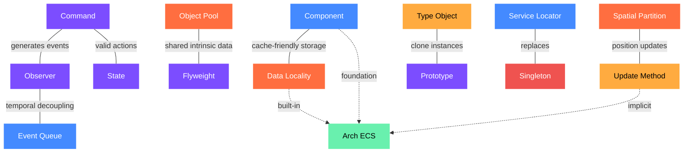

# G18 — Game Programming Patterns

> **Category:** Guide · **Related:** [G12 Design Patterns](./G12_design_patterns.md) · [G1 Custom Code Recipes](./G1_custom_code_recipes.md) · [G3 Physics & Collision](./G3_physics_and_collision.md) · [G11 Programming Principles](./G11_programming_principles.md) · [G13 C# Performance](./G13_csharp_performance.md) · [G15 Game Loop](./G15_game_loop.md)

---

20 game programming patterns from Robert Nystrom's *Game Programming Patterns*, adapted for MonoGame + Arch ECS development. Each pattern includes intent, how it works, game application, and ECS considerations. For concrete C# implementations of overlapping patterns (Observer, Command, State, Flyweight, Service Locator), see [G12 Design Patterns](./G12_design_patterns.md).

---

## Pattern Overview

| Pattern | Category | Primary Use Case |
|---------|----------|-----------------|
| Command | Revisited | Input handling, undo systems, AI actions, replay |
| Flyweight | Revisited | Terrain tiles, particle systems, forest rendering |
| Observer | Revisited | Achievement systems, UI updates, event-driven audio |
| Prototype | Revisited | Spawning enemy variants, data-driven entity creation |
| Singleton | Revisited | File system access, logging (prefer alternatives) |
| State | Revisited | Character animation states, menu flow, AI behavior |
| Double Buffer | Sequencing | Framebuffer rendering, scene graph updates |
| Game Loop | Sequencing | Core engine loop with fixed timestep updates |
| Update Method | Sequencing | Entity behavior, animation updates, physics stepping |
| Bytecode | Behavioral | Modding systems, scripted abilities, level triggers |
| Subclass Sandbox | Behavioral | Spell/ability variety with shared infrastructure |
| Type Object | Behavioral | Monster breeds, weapon types, item categories |
| Component | Decoupling | Entity-component architecture, modular game objects |
| Event Queue | Decoupling | Audio playback, cross-system communication |
| Service Locator | Decoupling | Audio, logging, and analytics service abstraction |
| Data Locality | Optimization | Hot-path component iteration, particle systems |
| Dirty Flag | Optimization | Transform hierarchies, derived data caching |
| Object Pool | Optimization | Bullets, particles, sound effects, visual effects |
| Spatial Partition | Optimization | Collision broad-phase, proximity detection, rendering culling |

---

## Design Patterns Revisited

These six patterns are drawn from the original Gang of Four catalog but reexamined through the lens of game development.

### Command

**Intent:** Encapsulate a request as an object, thereby decoupling what is requested from who requests it and when it executes.

**How It Works:** A Command wraps a method call inside an object with an `execute()` method. Instead of directly calling `jump()` when a button is pressed, you create a JumpCommand object and invoke its `execute()` method. This indirection enables powerful capabilities: commands can be stored in a history stack for undo/redo, serialized for network replay, or routed through an AI system that generates commands identically to player input. The key insight is that a command is a reified method call — it turns an action into data you can manipulate.

**Game Application:** Input remapping is the most immediate application. By storing Command pointers for each button, players can rebind controls at runtime. For turn-based strategy games, commands enable full undo by maintaining a history stack with inverse operations. In multiplayer games, serializing command streams across the network enables deterministic replay. AI systems can emit the same Command objects as the input handler, creating a clean separation between decision-making and action execution.

**MonoGame / ECS Considerations:** In Arch ECS, commands can be modeled as entities with command components, processed by a CommandExecutionSystem each frame. Input systems create command entities rather than modifying game state directly. This naturally supports queuing, prioritization, and undo history through additional components.

---

### Flyweight

**Intent:** Share intrinsic state across many instances to minimize memory usage while maintaining the illusion of unique objects.

**How It Works:** Flyweight separates object data into two categories: intrinsic state that is identical across all instances (mesh geometry, textures, base stats) and extrinsic state that varies per instance (position, health, color tint). The intrinsic data is stored once and shared via references, while each instance only carries its unique extrinsic data.

**Game Application:** A forest scene might contain ten thousand trees, but only five or six distinct tree models. Each tree instance stores only its position, scale, and color variation while sharing references to the underlying mesh and texture data. Terrain systems similarly benefit: a tile map may contain millions of cells, but only a handful of distinct terrain types (grass, water, stone) with shared rendering properties, movement costs, and footstep sounds.

**MonoGame / ECS Considerations:** Arch ECS naturally promotes flyweight thinking. Shared data lives in resource objects or singleton components, while per-entity data resides in lightweight components. MonoGame's content pipeline already shares Texture2D and SpriteFont instances, extending the flyweight concept to asset management.

---

### Observer

**Intent:** Define a one-to-many dependency between objects so that when one object changes state, all its dependents are notified automatically.

**How It Works:** The Observer pattern establishes a subject that maintains a list of interested observers. When the subject's state changes, it iterates through its observer list and calls a notification method on each one. Observers can register and unregister dynamically, creating a loosely coupled communication channel. The subject never needs to know anything about the concrete types observing it.

**Game Application:** Achievement systems are the canonical game example. A physics system detects a character falling off a bridge and notifies all observers. The achievement system unlocks "Fall off a Bridge," the audio system plays a scream, and the UI system shows a notification — all without the physics system knowing any of those systems exist. Health bar updates, score displays, and tutorial triggers all follow this publisher-subscriber model.

**MonoGame / ECS Considerations:** In ECS, observer patterns can be implemented through event components or through Arch's built-in query filters that detect component additions and removals. Systems that need to react to changes can query for entities with newly added or modified marker components. See [G12 Design Patterns](./G12_design_patterns.md) for a full C# implementation with the critical pitfall of unsubscribing on destroy.

---

### Prototype

**Intent:** Create new objects by cloning existing instances, using prototypical objects as templates rather than classes.

**How It Works:** Rather than building objects from class hierarchies, Prototype uses existing instances as templates. A `clone()` method creates a deep copy of the prototype, and the new instance can then be customized. This shifts type definition from compile-time class declarations to runtime data, enabling designers to create new entity types without writing code.

**Game Application:** Monster spawning benefits enormously from prototyping. A designer creates a base "Goblin" prototype with specific stats, visuals, and behaviors. Variants like "Goblin Archer" clone the base and override the weapon component. The spawner doesn't need class-per-monster-type — it just clones the appropriate prototype and customizes it. This pattern also underpins data-driven design where entity definitions live in JSON or XML files.

**MonoGame / ECS Considerations:** Arch ECS supports prototype-like behavior through archetype templates. You can define a set of components representing a prototype entity and clone that component set onto new entities at spawn time, overriding specific values as needed.

---

### Singleton

**Intent:** Ensure a class has only one instance and provide a global point of access to it.

**How It Works:** Singleton restricts instantiation to a single object accessed through a static method. While convenient, it introduces hidden coupling, makes testing difficult, impedes concurrency, and creates initialization order dependencies. Nystrom argues strongly that Singleton is overused in game development. In most cases, the actual need is for convenient access (solved by Service Locator or dependency injection) or for uniqueness guarantees (solved by assertions in constructors).

**Game Application:** File system wrappers and logging services are reasonable Singleton candidates because they genuinely require single-instance semantics. However, game managers, audio systems, and input handlers are often wrongly made Singletons when they would be better served by dependency injection or service location. Every Singleton is effectively a global variable with initialization overhead.

**MonoGame / ECS Considerations:** In ECS, singletons are largely unnecessary. Unique services can be stored as singleton components or resources accessible to any system. Arch ECS provides world-level resource storage that gives systems access to shared state without global variables.

---

### State

**Intent:** Allow an object to alter its behavior when its internal state changes, making it appear to change its class.

**How It Works:** The State pattern replaces conditional logic (chains of if/else or switch statements) with polymorphic state objects. Each state encapsulates the behavior and transitions relevant to that state. The owning object delegates behavior calls to its current state object, which handles them and optionally triggers transitions to other states. This is a formalization of finite state machines (FSMs), which can be extended to hierarchical state machines or pushdown automata for more complex behavior modeling.

**Game Application:** Character animation controllers are the most common application. A hero character might have Standing, Running, Jumping, and Ducking states, each handling input differently and defining valid transitions. AI behavior also maps naturally to state machines: Patrol, Chase, Attack, and Flee states with transitions driven by sensory input.

**MonoGame / ECS Considerations:** State components in Arch ECS can be modeled as enum-based components or as tag components that systems query against. State machine logic lives in dedicated systems that process entities with specific state components and apply transitions by swapping components. See [G12 Design Patterns](./G12_design_patterns.md) for a full C# state machine implementation.

---

## Sequencing Patterns

These patterns govern the temporal orchestration of a game — how the simulation advances, how entities receive their per-frame updates, and how rendering synchronizes with state changes.

### Double Buffer

**Intent:** Maintain two copies of state and swap them atomically so that readers always see a complete, consistent snapshot.

**How It Works:** Double buffering uses two interchangeable buffers: one being read from (the "current" buffer) and one being written to (the "next" buffer). When writing is complete, the buffers swap roles. This prevents tearing, where a reader sees a partially updated state.

**Game Application:** The most visible application is framebuffer rendering, where the GPU reads from one buffer while the CPU writes the next frame into the other. But double buffering also applies to game state: if entities read each other's state during updates, a double-buffered state array ensures each entity sees the previous frame's consistent state rather than a mix of current and previous values.

**MonoGame / ECS Considerations:** MonoGame handles framebuffer double buffering internally through the graphics device. For game-state double buffering in ECS, you can maintain two component arrays and swap references between frames, or use frame-stamped components to distinguish current from previous state.

---

### Game Loop

**Intent:** Decouple the progression of game time from user input and processor speed.

**How It Works:** The game loop continuously cycles through processing input, updating game state, and rendering. The critical design decision is how to handle variable frame rates. A fixed timestep with variable rendering (updating game logic at a constant rate while rendering as fast as possible with interpolation) provides deterministic simulation while adapting to hardware capabilities. The loop must also handle the "spiral of death" where slow updates cause accumulating lag.

**Game Application:** A robust game loop uses a fixed timestep (e.g., 60 updates per second) with an accumulator pattern. Each frame, the elapsed real time is added to the accumulator. The update step runs repeatedly until the accumulator is drained below one timestep. The remaining fractional timestep is used for render interpolation, producing smooth visuals.

**MonoGame / ECS Considerations:** MonoGame provides `Game.Update()` and `Game.Draw()` with built-in fixed timestep support via `IsFixedTimeStep` and `TargetElapsedTime`. See [G15 Game Loop](./G15_game_loop.md) for detailed implementation and optimization.

---

### Update Method

**Intent:** Simulate a collection of independent objects by giving each one a per-frame update call.

**How It Works:** Each game entity implements an `update()` method that advances its state by one timestep. The game loop iterates through all active entities and calls their update methods. This distributes behavior across objects rather than centralizing it in one monolithic function. The pattern requires careful attention to update order, handling of entity creation and destruction during iteration, and ensuring the elapsed time parameter is used for frame-rate-independent behavior.

**Game Application:** Every active game object — enemies patrolling, projectiles flying, particles fading, doors opening — receives an update call each frame.

**MonoGame / ECS Considerations:** In Arch ECS, the Update Method is implicit in the system architecture. Each system's query-and-process loop is effectively an update method applied to all entities matching specific component archetypes. Systems execute in a defined order, providing deterministic update sequencing.

---

## Behavioral Patterns

These patterns address how game behavior is defined, composed, and extended — enabling designers and modders to create new content without modifying engine code.

### Bytecode

**Intent:** Encode behavior in a data-driven instruction set executed by a lightweight virtual machine.

**How It Works:** Bytecode defines a custom instruction set for a virtual machine embedded in the game engine. Game behaviors are compiled into sequences of these instructions and executed interpretively. This creates a sandboxed, portable behavior layer that can be loaded from data files, transmitted over the network, or modified at runtime. The VM can enforce resource limits (instruction count caps, memory bounds) to prevent infinite loops or exploits.

**Game Application:** Spell systems benefit greatly from bytecode. Each spell is a short bytecode program that manipulates game state: deal damage, apply status effects, spawn particles, play sounds. Designers author spells through a visual editor that compiles to bytecode, enabling thousands of unique abilities without any engine code changes.

**MonoGame / ECS Considerations:** For MonoGame projects, a lightweight bytecode interpreter can be implemented in C# and integrated as an ECS system. Bytecode programs are stored as component data on entities that need scripted behavior, and a BytecodeExecutionSystem processes them each frame.

---

### Subclass Sandbox

**Intent:** Define behavior in subclasses using only a set of primitive operations provided by the base class.

**How It Works:** The base class provides a protected API of primitive operations — play sound, spawn particle, apply damage, etc. Subclasses implement their unique behavior by composing these primitives in their own `activate()` or `execute()` method. This constrains what subclasses can do while enabling tremendous variety in how those operations are combined.

**Game Application:** A spell system might have a base Spell class with primitives like `dealDamage()`, `applyBuff()`, `spawnEffect()`, and `playSound()`. A FireballSpell combines `dealDamage()` with `spawnEffect("fire")`, while a HealingAura uses `applyBuff()` with `spawnEffect("glow")`. Hundreds of unique spells are possible without expanding the base class API.

**MonoGame / ECS Considerations:** In ECS, subclass sandbox translates to composable behavior components. Instead of class inheritance, different combinations of effect components (DamageComponent, BuffComponent, ParticleComponent) on ability entities achieve similar compositional variety through data rather than code.

---

### Type Object

**Intent:** Allow flexible creation of new logical types by storing type information in data objects rather than defining new classes.

**How It Works:** Rather than creating a class for every monster type (Dragon, Goblin, Troll), you create a single Monster class with a reference to a Breed object that contains the type-specific data: health, attack, speed, and texture. New monster types are created by instantiating new Breed objects with different data. Breeds can even inherit from other breeds, forming data-driven inheritance hierarchies.

**Game Application:** Monster breeds, weapon categories, item types, terrain definitions, and skill trees can all be defined as type objects loaded from data files. A game might ship with 200 monster types, all defined in a JSON configuration file and represented by a single Monster class with 200 Breed instances.

**MonoGame / ECS Considerations:** Arch ECS aligns perfectly with Type Object. Component data on entities effectively serves as the type definition. An entity's archetype (its set of components) defines its type, and component values define its specific properties.

---

## Decoupling Patterns

These patterns address the web of dependencies that emerges as game systems grow, providing structured approaches to communication between systems without creating brittle direct references.

### Component

**Intent:** Decompose an entity into reusable, single-responsibility components that can be mixed and matched.

**How It Works:** Instead of deep inheritance hierarchies (GameObject > Character > Enemy > FlyingEnemy > FlyingBossEnemy), the Component pattern decomposes entities into orthogonal components: PositionComponent, RenderComponent, PhysicsComponent, AIComponent, HealthComponent. An entity is simply a container of components. This eliminates the diamond inheritance problem, enables emergent entity types through new component combinations, and allows systems to process components independently.

**Game Application:** A character entity might have Position, Sprite, Physics, Health, and Input components. An environmental hazard shares Position, Sprite, and a DamageZone component but has no Health or Input. A particle effect has only Position, Sprite, and Lifetime.

**MonoGame / ECS Considerations:** This is the foundational pattern of Arch ECS and the entire architecture. Arch provides efficient component storage, archetype-based queries, and system scheduling. Every entity is defined purely by its component composition.

---

### Event Queue

**Intent:** Decouple the sender of a message from its receiver by routing messages through an asynchronous queue.

**How It Works:** The Event Queue extends the Observer pattern with temporal decoupling. Instead of immediately calling all observers when an event occurs, the event is placed in a queue. A separate processing step dequeues events and dispatches them to handlers. This prevents cascading call stacks, provides control over when events are processed, and enables batching and prioritization. Ring buffers provide an efficient fixed-size implementation.

**Game Application:** Audio systems are the quintessential Event Queue application. Game systems don't call `playSound()` directly — they enqueue a PlaySoundRequest with the sound ID, volume, and position. The audio system pulls from the queue during its update, enabling it to batch similar sounds, limit simultaneous instances, and prioritize critical audio.

**MonoGame / ECS Considerations:** In Arch ECS, event queues can be implemented as component-based message entities or as dedicated ring buffer resources that systems produce into and consume from. The ECS system execution order naturally provides the temporal decoupling.

---

### Service Locator

**Intent:** Provide a global access point to a service without coupling code to the concrete implementation.

**How It Works:** Service Locator maintains a registry of service interfaces. Client code requests a service by interface type and receives whatever concrete implementation has been registered. This enables swapping implementations at runtime (a real audio system vs. a null audio system for testing), configuring services through data, and accessing services without direct dependency on their implementations.

**Game Application:** An AudioService locator might return a full implementation during gameplay but a NullAudioService during testing or when audio is disabled. A LoggingService might return a FileLogger in development and a NullLogger in release builds.

**MonoGame / ECS Considerations:** In ECS, service location is achieved through world-level resources. Systems access shared services by querying the world for resource types. See [G12 Design Patterns](./G12_design_patterns.md) for a C# Service Locator implementation.

---

## Optimization Patterns

These patterns tackle the performance constraints inherent in real-time game simulation — memory allocation overhead, CPU cache efficiency, redundant computation, and spatial query performance.

### Data Locality

**Intent:** Arrange data in contiguous memory to maximize CPU cache utilization during iteration.

**How It Works:** Modern CPUs access RAM through a cache hierarchy. When data is scattered across the heap, each access risks a cache miss costing hundreds of CPU cycles. Data Locality reorganizes objects so that data processed together lives together in memory. Instead of iterating through an array of pointers to game objects scattered across the heap, you iterate through contiguous arrays of component data.

**Game Application:** A particle system processing 10,000 particles each frame benefits enormously from contiguous storage. Separating hot data (position, velocity) from cold data (creation timestamp, debug name) ensures the cache lines pulled during hot-path iteration contain only relevant data.

**MonoGame / ECS Considerations:** Arch ECS stores component data in dense, contiguous arrays organized by archetype. This is Data Locality by design. See [G13 C# Performance](./G13_csharp_performance.md) for additional cache-friendly techniques.

---

### Dirty Flag

**Intent:** Track changes to source data and defer expensive derived recalculations until the results are actually needed.

**How It Works:** When derived data depends on source data that changes frequently but is read infrequently, recalculating the derived data on every source change wastes effort. A dirty flag marks the derived data as stale when the source changes. The derived data is only recalculated when it is next accessed.

**Game Application:** Scene graph transform hierarchies are the classic application. When a parent object moves, all children's world transforms become stale. Rather than immediately recalculating every descendant's world transform, each node is flagged dirty. World transforms are only recalculated when the rendering system needs them.

**MonoGame / ECS Considerations:** In ECS, dirty flags can be implemented as marker components (DirtyTransform) added when source data changes and removed after recalculation. Systems that produce derived data check for the dirty marker before doing expensive work.

---

### Object Pool

**Intent:** Pre-allocate a pool of reusable objects to avoid the cost of runtime allocation and garbage collection.

**How It Works:** Object Pools maintain a collection of pre-initialized, inactive objects. When a new object is needed, one is pulled from the pool and activated. When the object is done, it is deactivated and returned rather than destroyed. This eliminates allocation overhead and GC pressure from rapidly created and destroyed objects.

**Game Application:** A machine gun might fire 20 bullets per second, each living for 2 seconds. Rather than allocating and deallocating 40 Bullet objects continuously, a pool of 50 pre-allocated bullets recycles efficiently. Particle effects, sound effect instances, hit-flash sprites, and floating damage numbers all benefit from pooling.

**MonoGame / ECS Considerations:** Arch ECS can implement pooling at the entity level. Rather than destroying entities, deactivate them by removing active marker components or moving them to a "pool" archetype. Reactivation restores the appropriate components. See [G1 Custom Code Recipes](./G1_custom_code_recipes.md) for the toolkit's ObjectPool implementation.

---

### Spatial Partition

**Intent:** Organize objects by their position in a data structure optimized for spatial queries.

**How It Works:** Naive collision detection or proximity queries are O(n²) because each object checks against every other object. Spatial partitions divide space into regions and assign objects to regions based on position. Queries then only check objects in the same or neighboring regions.

Common implementations:
- **Grids** — simple, constant memory, fast updates
- **Quadtrees** — adaptive to density
- **BSP trees** — good for static geometry
- **Spatial hashing** — efficient for uniform distributions

**Game Application:** Collision broad-phase is the most performance-critical application. Before testing exact collision between sprite boundaries, a spatial grid eliminates pairs of objects that are clearly too far apart. AI proximity queries ("find all enemies within 50 units") and rendering culling similarly benefit.

**MonoGame / ECS Considerations:** For 2D MonoGame projects, a uniform grid or spatial hash is typically the best fit due to implementation simplicity and good performance characteristics. The grid cell size should match your typical entity interaction range. See [G1 Custom Code Recipes](./G1_custom_code_recipes.md) for the SpatialHash implementation and [G3 Physics & Collision](./G3_physics_and_collision.md) for integration with collision detection.

---

## Pattern Relationships & Synergies

| Combination | Synergy |
|-------------|---------|
| **Command + Observer** | Commands generate events that observers consume. An undo system uses Command history while the UI observes state changes to update displays |
| **Component + Data Locality** | The Component pattern decomposes entities; Data Locality ensures component data is stored in cache-friendly contiguous arrays. ECS architectures unify both |
| **State + Command** | State machines determine which commands are valid in the current state. A Jumping state rejects a Duck command but accepts an Attack command |
| **Object Pool + Flyweight** | Pooled objects share flyweight intrinsic data. A bullet pool reuses bullet entities that all reference the same shared bullet mesh and texture |
| **Observer + Event Queue** | Event Queue extends Observer with temporal decoupling. Observers register interest; the queue defers notification to a controlled processing window |
| **Type Object + Prototype** | Type Objects define shared type data; Prototypes clone instances with that type data pre-configured |
| **Spatial Partition + Update Method** | Spatial partitions must be updated as entities move. The Update Method integration ensures the partition stays current with entity positions |
| **Service Locator + Singleton** | Service Locator replaces most Singleton usage by providing global access without coupling to concrete types, enabling testing and runtime swapping |

---

## Implementation Priority Matrix

| Pattern | Priority | Complexity | Impact | When to Adopt |
|---------|----------|-----------|--------|---------------|
| Game Loop | Critical | Low | High | Day one — foundational infrastructure |
| Component | Critical | Medium | High | Day one — defines entity architecture |
| Update Method | Critical | Low | High | Day one — core simulation driver |
| State | High | Medium | High | Early — when characters have multiple behaviors |
| Command | High | Medium | High | Early — when input handling grows complex |
| Observer | High | Low | Medium | Early — when systems need loose coupling |
| Object Pool | High | Low | High | When allocation patterns cause GC spikes |
| Spatial Partition | High | Medium | High | When collision detection becomes a bottleneck |
| Data Locality | Medium | Low | High | Built into Arch ECS — leverage automatically |
| Event Queue | Medium | Medium | Medium | When observer notifications cause cascading updates |
| Flyweight | Medium | Low | Medium | When memory usage for similar objects is high |
| Service Locator | Medium | Low | Medium | When testing requires swappable services |
| Dirty Flag | Medium | Low | Medium | When derived data recalculation is expensive |
| Type Object | Medium | Low | Medium | When data-driven entity types are needed |
| Prototype | Low | Low | Low | When entity spawning needs cloning semantics |
| Subclass Sandbox | Low | Low | Low | When ability variety grows significantly |
| Double Buffer | Low | Medium | Low | Handled by MonoGame and GPU drivers |
| Bytecode | Low | High | Medium | Only if modding or scripting is a requirement |
| Singleton | Avoid | Low | Negative | Use Service Locator or ECS resources instead |

---

## Architecture Guidelines

The patterns in this document are tools, not mandates. Robert Nystrom emphasizes that the goal is not to apply every pattern but to understand the tradeoffs each represents and deploy them where they solve real problems.

### Simplicity First
The simplest code that solves the problem is the best code. Patterns add abstraction, and abstraction has a cost. Apply a pattern only when the problem it solves has actually manifested, not in anticipation of future needs. A straightforward if/else chain is preferable to a State pattern when there are only two states.

### Performance Awareness
Games are real-time software with hard frame budgets. Every abstraction should be evaluated against its performance characteristics. Virtual dispatch, heap allocation, cache misses, and indirection all have measurable costs. Profile before optimizing, but design with performance awareness from the start. See [G13 C# Performance](./G13_csharp_performance.md).

### Decoupling Over Coupling
The most insidious bugs and the hardest refactors come from tightly coupled systems. Patterns like Component, Observer, Event Queue, Command, and Service Locator all trade a small amount of runtime cost for dramatic improvements in modularity.

### Data-Driven Design
Patterns like Type Object, Prototype, Flyweight, and Bytecode shift game definition from code to data. This enables faster iteration, empowers designers to create content without programmer involvement, and makes the game more extensible.

### Know When to Break the Rules
Every guideline has legitimate exceptions. Singleton is sometimes the right choice. A monolithic update function is sometimes clearer than a State pattern. Direct coupling is sometimes faster and simpler than event-driven communication. The mark of an experienced developer is knowing when a pattern's benefits outweigh its costs in a specific context.

---

*Source: Game Programming Patterns by Robert Nystrom — gameprogrammingpatterns.com*
