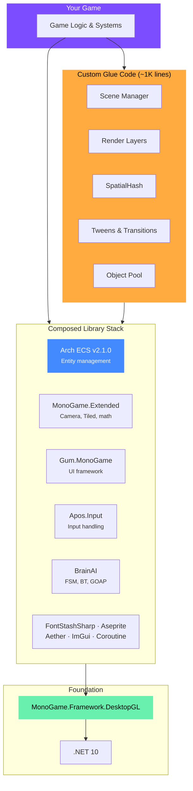

# E1 — Architecture Overview
> **Category:** Explanation · **Related:** [R1 Library Stack](../R/R1_library_stack.md) · [E2 Why Nez Was Dropped](./E2_nez_dropped.md) · [G1 Custom Code Recipes](../G/G1_custom_code_recipes.md)

---

## Core Philosophy: Library Composition, Not a Monolith

The single most important architectural decision: **do not depend on a monolith framework**. When a monolith's sole maintainer leaves, everything dies at once (this is exactly what happened with Nez — see [E2](./E2_nez_dropped.md)).

The correct architecture is a **composed stack of focused, actively maintained libraries**, each replaceable independently. If one library dies, you swap that one piece — not your entire game's foundation.

---

## One Entity Model: Arch ECS for Everything

Arch ECS handles **both** mass entities (bullets, particles, swarms) **and** unique entities (player, NPCs, bosses). There is no need for a separate Entity-Component system.

A player is just an entity with a `PlayerTag` component. A `PlayerMovementSystem` that queries for `PlayerTag + Position + Velocity` is equivalent to a behavioral `PlayerMovementComponent.Update()` method, but with better cache coherence and testability.

**Benefits of one entity model:**
- No bridge code between two entity systems
- No mental context-switching between EC and ECS paradigms
- One query language for spatial lookups, collision, AI decisions
- Simpler serialization (Arch.Persistence handles the whole world)

### Arch NuGet Packages

```
Arch                          -- Core ECS (v2.1.0)
Arch.System                   -- Base system classes
Arch.System.SourceGenerator   -- Auto-generate system boilerplate
Arch.Relationships            -- Entity-to-entity relationships
Arch.EventBus                 -- Typed event bus
Arch.Persistence              -- Serialization/deserialization of worlds
Arch.AOT.SourceGenerator      -- AOT-compatible source gen (mobile)
```

### When Arch ECS Shines Most

| Scenario | Why Arch |
|----------|----------|
| Bullets, projectiles (hundreds+) | Cache-optimal iteration over flat arrays |
| Cellular automata / simulation grids | Bulk query operations |
| Particle systems (thousands) | Source-generated systems eliminate boilerplate |
| RTS units (hundreds of similar entities) | Spatial queries via archetypes |
| Vampire Survivors-style swarms | Command buffers for safe multithreaded spawning/despawning |
| Player, NPCs, bosses (unique entities) | `PlayerTag` component + dedicated systems — simple, testable |
| Inventory items as data | Arch.Relationships for entity-to-entity links |

---

## Architecture Stack



---

## The Composed Library Stack

Each library handles one concern and is independently swappable:

| Concern | Library | Fallback if it dies |
|---------|---------|-------------------|
| Entity management | Arch ECS | Other C# ECS libs (DefaultECS, LeoECS) |
| Camera, math, Tiled maps | MonoGame.Extended | Custom code (~200 lines each) |
| UI | Gum.MonoGame | Myra (still viable) |
| Input | Apos.Input | MonoGame.Input directly |
| Fonts | FontStashSharp | SpriteFonts (ugly but functional) |
| Sprites | MonoGame.Aseprite | Manual spritesheet parsing |
| Physics | Aether.Physics2D | Farseer (older) or custom |
| AI | BrainAI | Custom FSM/BT (~300 lines each) |
| Debug | ImGui.NET | Console.WriteLine (always works) |
| Coroutines | Ellpeck/Coroutine | Custom IEnumerator wrapper (~60 lines) |

**Full package list and install commands:** see [R1 Library Stack](../R/R1_library_stack.md).

---

## Custom Glue Code (~1,000 lines total)

Some things are better written yourself than taken from a library. The total custom code budget:

| Module | Lines | Time |
|--------|-------|------|
| Scene manager | ~150 | 2 hours |
| Render layer system | ~200 | 3 hours |
| SpatialHash broadphase | ~80 | 1 hour |
| Collision shapes (AABB, circle, polygon) | ~150 | 2 hours |
| Tween system | ~100 | 1.5 hours |
| Screen transitions | ~100 | 1.5 hours |
| Post-processor pipeline | ~150 | 2 hours |
| Object pool | ~30 | 0.5 hours |
| Line renderer | ~50 | 1 hour |
| **Total** | **~1,010** | **~14.5 hours** |

Every line is code you own, understand, and can debug. Implementation details and starter code are in [G1 Custom Code Recipes](../G/G1_custom_code_recipes.md).

---

## What You Gain

1. **No frozen dependency risk** — every library is actively maintained or self-owned code
2. **One entity model** — Arch ECS for everything, no bridge code
3. **NuGet everything** — no git submodule management, `dotnet restore` gets you running
4. **Modern .NET compatibility** — nothing blocks .NET 10 or MonoGame 3.8.5+
5. **Better UI** — Gum is a massive upgrade (visual editor, forms controls, official MonoGame backing)
6. **Smaller attack surface** — ~1,000 lines of custom code vs. ~50,000+ lines of framework source
7. **Faster builds** — no compiling a massive framework submodule

---

## Cross-Platform Validation

This architecture has been validated on:

| Platform | Runtime | Status |
|----------|---------|--------|
| Desktop (DesktopGL) | Windows, macOS, Linux | Primary dev target |
| iOS | net10.0-ios, iOS 15.0+ | Full feature parity |
| Android | TBD | Not yet implemented |

The Core project (95%+ of code) requires **zero platform-specific changes**. Platform projects are thin launchers — Desktop is 3 lines, iOS is ~25 lines (AppDelegate + deferred game creation). Content, ECS systems, rendering, and all game logic are shared.

See [R3 Project Structure](../R/R3_project_structure.md) for iOS project setup and the AppDelegate pattern.
